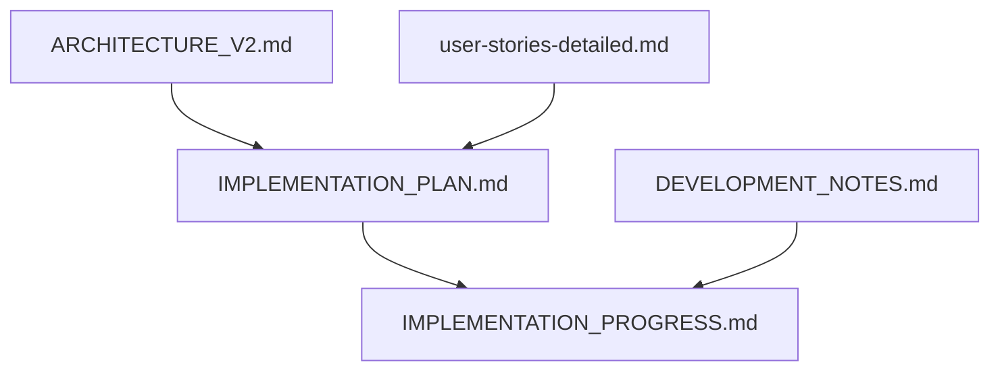

# Documentation Structure

This document explains the organization and relationships between various documentation files in the project.

## Core Documentation Files

1. `specs/ARCHITECTURE_V2.md`
   - System architecture and design
   - Technology stack and versions
   - Component interactions
   - Infrastructure design

2. `specs/IMPLEMENTATION_PLAN.md`
   - 6-week implementation roadmap
   - Phase definitions and deliverables
   - Success metrics
   - Risk management

3. `IMPLEMENTATION_PROGRESS.md`
   - Current implementation status
   - Phase completion tracking
   - Test coverage metrics
   - Next steps and blockers

4. `DEVELOPMENT_NOTES.md`
   - Development patterns
   - Code organization
   - Technical guidelines
   - Implementation decisions

5. `specs/user-stories-detailed.md`
   - User requirements
   - Acceptance criteria
   - Feature prioritization

## Version Standards

- Python: 3.13.5+
- FastAgent: 0.3.17+
- FastAPI: Latest stable
- Gradio: Latest stable
- ChromaDB: Latest stable

## Timeline Overview

**6-Week MVP Timeline:**
- Week 1: Environment Setup
- Week 2: Document Processing Pipeline
- Week 2-3: FastAPI Backend
- Week 3-4: FastAgent Implementation
- Week 4-5: Gradio Frontend
- Week 5-6: Testing, Documentation, Polish

## Development Workflow

1. Check `IMPLEMENTATION_PROGRESS.md` for current status
2. Review relevant section in `IMPLEMENTATION_PLAN.md`
3. Follow patterns in `DEVELOPMENT_NOTES.md`
4. Update progress and metrics in `IMPLEMENTATION_PROGRESS.md`

## Document Relationships

*Last updated: 2025-11-10*